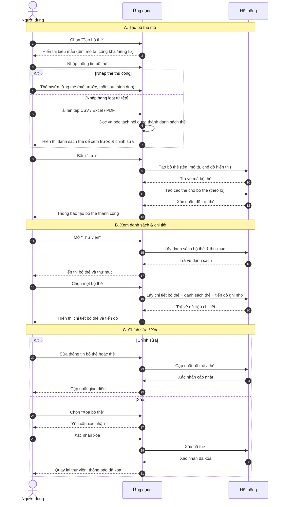
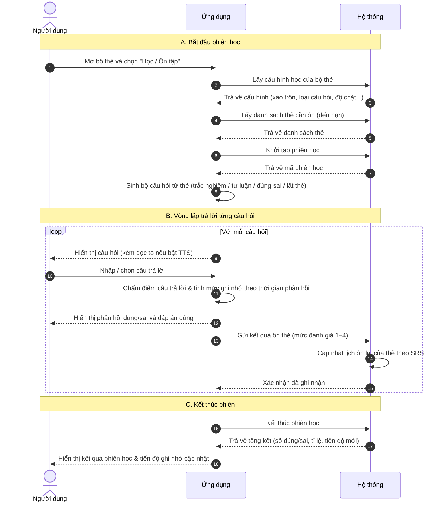

# mem_pan — Sơ đồ luồng nghiệp vụ (Sequence Diagrams)

> Tài liệu dành cho BA trao đổi với khách hàng. Mô tả 2 luồng nghiệp vụ chính của ứng dụng học từ vựng theo phương pháp lặp lại ngắt quãng (SRS):
> 1. **Quản lý bộ thẻ (Deck)**
> 2. **Học & Ôn tập (Study & Review)**
>
> Các thành phần tham gia:
> - **Người dùng**: người học sử dụng ứng dụng.
> - **Ứng dụng**: app di động / web mà người dùng thao tác trực tiếp.
> - **Hệ thống**: máy chủ (backend) xử lý nghiệp vụ và lưu trữ dữ liệu.

---

## 1. Luồng Quản lý bộ thẻ (Deck)

Luồng này mô tả việc người dùng **tạo, xem, chỉnh sửa và xóa** bộ thẻ cùng các thẻ học bên trong, bao gồm cả nhập liệu hàng loạt từ tệp (CSV / Excel / PDF).

---

## 2. Luồng Học & Ôn tập (Study & Review)

Luồng này mô tả một **phiên học/ôn tập**: hệ thống chọn thẻ cần ôn, sinh câu hỏi (trắc nghiệm, tự luận, đúng/sai, lật thẻ), chấm câu trả lời và ghi nhận mức độ ghi nhớ theo cơ chế SRS để lên lịch ôn lại.

---

## Phụ lục: Mức đánh giá ghi nhớ (SRS)

Sau mỗi câu trả lời, hệ thống ghi nhận một mức đánh giá quyết định thời điểm thẻ được ôn lại:

| Mức | Tên | Khi nào | Lần ôn kế tiếp |
|-----|------|---------|----------------|
| 1 | Lại (Again) | Trả lời sai | Rất sớm |
| 2 | Khó (Hard) | Đúng nhưng chậm (> 8 giây) | Khoảng cách vừa |
| 3 | Tốt (Good) | Đúng, tốc độ bình thường (3–8 giây) | Khoảng cách tiêu chuẩn |
| 4 | Dễ (Easy) | Đúng và nhanh (< 3 giây) | Khoảng cách dài |

> Thuật toán lên lịch ôn lại do **Hệ thống** xử lý; ứng dụng chỉ gửi mức đánh giá.
